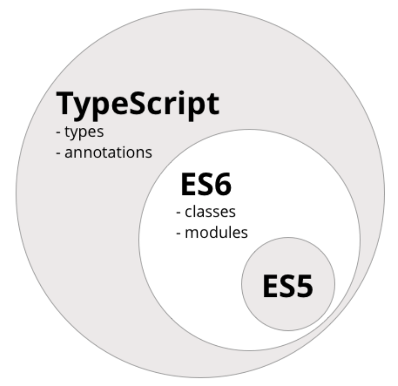
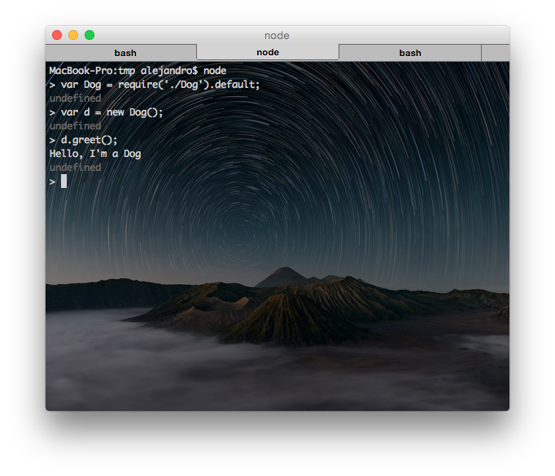
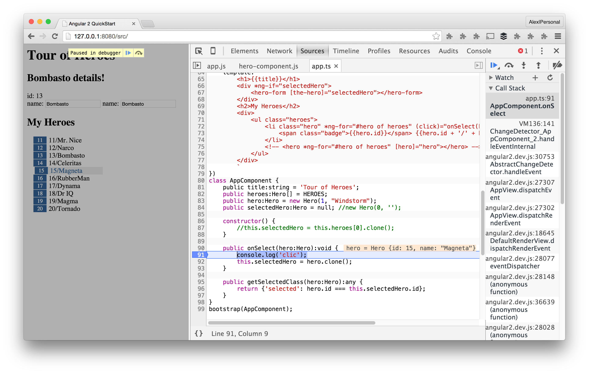
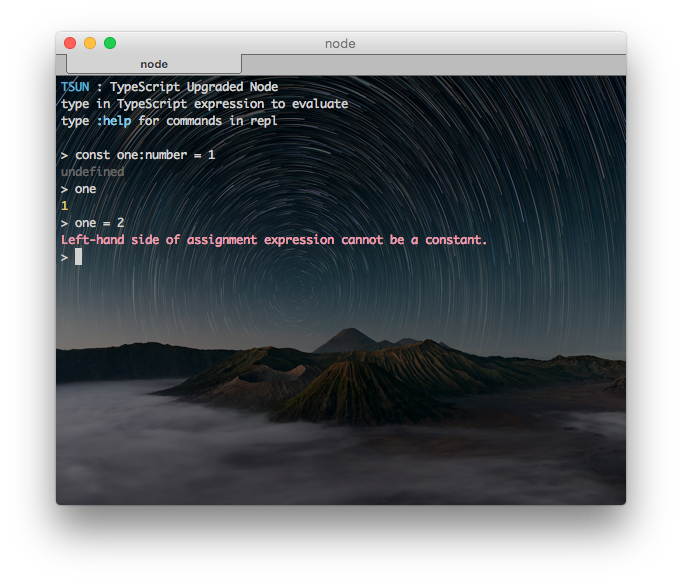
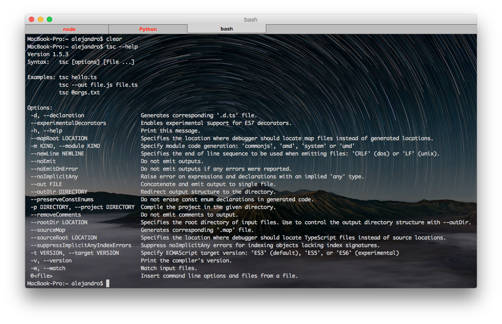
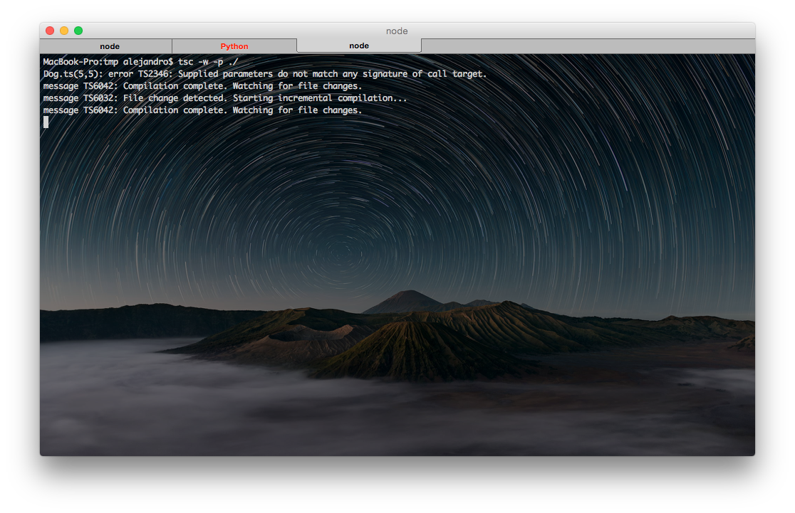

# Introducción a TypeScript

<i class="fa fa-smile-o"></i> Alejandro Such Berenguer

<i class="fa fa-envelope-o"></i> alejandro.such@gmail.com

<i class="fa fa-twitter"></i> @alejandro_such


## Requisitos

Instalación de TypeScript

<code>
$ npm install -g tsc
</code>


## Requisitos

Instalación de [tsd](https://github.com/DefinitelyTyped/tsd)

<code>
$ npm install -g tsd
</code>


## Requisitos

Instalación de [tsun](https://github.com/HerringtonDarkholme/typescript-repl) (TypeScript-Upgraded Node)

<code>
$ npm install -g tsun
</code>


## ¿Qué es TypeScript?

No es un lenguaje nuevo, sino un superset de ES6



---
Todo lo que hagamos en ES5 o ES6 será compatible con TypeScript


Muy pocos navegadores entienden ES6

Mucho menos TypeScript

Para ello, utilizamos transpilers


Un transpiler convierte código TypeScript a algo que entiende el navegador


Transpilers de ES6

 - [Babel](https://babeljs.io/)
 - [Traceur](https://github.com/google/traceur-compiler) (Google)


Transpiler de TypeScript

 - tsc


##Transpilando TypeScript

 Animal.ts

 ```
 export default class Animal {
   name: string;

   constructor(name) {
     this.name = name;
   }

   public greet():void {
     var msg:string = `Hello, I'm a ${this.name}`;
     console.log(msg);
   }
 }
 ```


##Transpilando TypeScript

 Dog.ts

 ```
 import Animal from './Animal';

 export default class Dog extends Animal {
   constructor() {
     super('Dog');
   }
 }
 ```


##Transpilando TypeScript

<code>
$ tsc Dog.ts --module commonjs
</code>


##Transpilando TypeScript

Animal.js

```
var Animal = (function () {
    function Animal(name) {
        this.name = name;
    }
    Animal.prototype.greet = function () {
        var msg = "Hello, I'm a " + this.name;
        console.log(msg);
    };
    return Animal;
})();
exports["default"] = Animal;

```


##Transpilando TypeScript

Dog.js

```
var __extends = (this && this.__extends) || function (d, b) {
    for (var p in b) if (b.hasOwnProperty(p)) d[p] = b[p];
    function __() { this.constructor = d; }
    d.prototype = b === null ? Object.create(b) : (__.prototype = b.prototype, new __());
};
var Animal_1 = require('./Animal');
var Dog = (function (_super) {
    __extends(Dog, _super);
    function Dog() {
        _super.call(this, 'Dog');
    }
    return Dog;
})(Animal_1["default"]);
exports["default"] = Dog;
```


##Transpilando TypeScript

```
//main.ts
import Animal from './Animal';
import Dog from './Dog';

var d:Animal = new Dog();

d.greet();
```


```
$ tsc main.ts --module commonjs
$ node main
Hello, I'm a Dog
```


##Transpilando TypeScript

Utilizándolo en node (ES5)




##Y cómo debugueo esto?

Muy bonito. Pero si escribo una cosa y ejecuto otra...

El código es un poco chungo, no?


Sourcemaps!





##¿Qué ofrece TypeScript?

 - tipos
 - clases
 - anotaciones (decorators)
 - ES6


##Tipos

Tipado opcional de los elementos de JavaScript.

El tipado establece restricciones en elementos del programa (funciones, variables…)

Esto se traduce en verificación y asistencia durante el desarrollo de software.

La verificación de tipos tiene lugar en tiempo de compilación, no en tiempo de ejecución.


## Any

Cualquier valor en JavaScript

```
var x: any;             // Explicitly typed  
var y;                  // Same as y: any  
var z: { a; b; };       // Same as z: { a: any; b: any; }

function f(x) {         // Same as f(x: any): void  
    console.log(x);  
}
```


## Number

Números de punto flotante y doble precisión en el formato IEEE 754 de 64 bits

```
var x: number;          // Explicitly typed  
var y = 0;              // Same as y: number = 0  
var z = 123.456;        // Same as z: number = 123.456  
var s = z.toFixed(2);   // Property of Number interface
```


## Boolean

Valores lógicos que pueden ser verdaderos o falsos

```
var b: boolean;         // Explicitly typed  
var yes = true;         // Same as yes: boolean = true  
var no = false;         // Same as no: boolean = false
```


## String

Secuencias de caracteres guardados como unidades de código en Unicode UTF-16

```
var s: string;          // Explicitly typed  
var empty = "";         // Same as empty: string = ""  
var abc = 'abc';        // Same as abc: string = "abc"  
var c = abc.charAt(2);  // Property of String interface
```


## Arrays

Podemos definirlos de dos maneras:

```
var jobs: Array<string> = ['IBM', 'Microsoft', 'Google'];
var jobs: Array<number> = [1, 2, 3];
```

```
var jobs: string[] = ['Apple', 'Dell', 'HP'];
var jobs: number[] = [4, 5, 6];
```


## Enums (I)

Un enum es un nombrado de valores numéricos y secuenciales.

```
enum Role {Employee, Manager, Admin};
var role: Role = Role.Employee;
```


## Enums (II)

El valor inicial es 0, pero podemos alterarlo

```
enum Role {Employee=3, Manager, Admin};
var role: Role = Role.Employee;
```


## Enums (y III)

Si queremos cambiar toda la secuencia

```
enum Role {Employee=3, Manager=5, Admin=7};
var role: Role = Role.Employee;
```


## Void

Se suele incluir en las funciones, cuando no se espera ningún valor de retorno

```
function setId(id:number):void {
  this.id = id;
}
```


## Clases

En ES5, la POO se hacía utilizando objetos basados en prototipos.

En ES6 ya hay clases como tal.

```
class Invoice {

}
```

Una clase tiene:

 - Propiedades
 - Métodos
 - Constructores


## Propiedades

Datos asociados a una clase

Son públicas por defecto

```
class Customer {
  private navCode: string;
  public firstName: string;
  lastName: string;  // public
  age: number;      // public
}
```


## Métodos

Funciones que se ejecutan en el contexto de un objetos

```
class Customer {
  navCode: string;
  firstName: string;
  lastName: string;

  getFullName():string {
    return `${this.firstName} ${this.lastName}`;
  }

  public static createNew() {
    return new User();
  }
}
```


##Constructores (I)

Métodos que se ejecutan cuando se crea una nueva instancia de la clase.

Una clase sólo puede tener un constructor.

Si no se especifica, se asume un constructor vacío por defecto.


##Constructores (y II)

No hace falta definir los miembros de la clase si se definen como <code>public</code> en el constructor

```
class Customer {
  constructor(public navCode:string, public firstName:string, public lastName:string) {

  }

  getFullName():string {
    return `${this.firstName} ${this.lastName}`;
  }
}
```


##Polimorfismo y Herencia

Soporte completo de la Herencia

```
class Animal {
  constructor(public name:string) {
  }
}

class Lion extends Animal {
  constructor() {
    super('Lion');
  }
}

Animal a = new Lion();
```


##Interfaces

```
interface IPerson {
  name: string;
  age:number;
}

class Person implements IPerson {
  constructor(public name:string, public age:number) {

  }
}
```


## Decorators

Son funciones que modifican una clase, propiedad, método o parámetro de un método

Su sintaxis es una <code>@</code> seguida de una función.

Ampliamente utilizado en Angular2


```
@readonly
class Person {
    name: string;
    isAdmin: boolean;

    constructor(name:string, admin: boolean) {
        this.name = name;
        this.isAdmin = admin;
    }
}
```


```
function readonly<TFunction extends Function>(Target: TFunction): TFunction {
    let newConstructor = function () {
        Target.apply(this);
        Object.freeze(this);
    };

    newConstructor.prototype = Object.create(Target.prototype);
    newConstructor.prototype.constructor = Target;

    return <any> newConstructor;
}
```


Posibles formas

```
declare type ClassDecorator = <TFunction extends Function>(target: TFunction) => TFunction | void;
declare type PropertyDecorator = (target: Object, propertyKey: string | symbol) => void;
declare type MethodDecorator = <T>(target: Object, propertyKey: string | symbol, descriptor: TypedPropertyDescriptor<T>) => TypedPropertyDescriptor<T> | void;
declare type ParameterDecorator = (target: Function, propertyKey: string | symbol, parameterIndex: number) => void;
```

 - [http://goo.gl/KXG9bt](http://goo.gl/KXG9bt)
 - [http://goo.gl/SA4ZuQ](http://goo.gl/SA4ZuQ)


### Decoradores de métodos (I)

 - `target`: el prototipo de la clase (`Object`)
 - `propertyKey`: el nombre del método (`string` | `symbol`)
 - `descriptor`: Un `TypedPropertyDescriptor`


### Decoradores de métodos (II)

```
class MyClass {
    @log
    myMethod(arg: string) {
        return "Message -- " + arg;
    }
}
```


### Decoradores de métodos (III)

```
function log(target: Object, propertyKey: string, descriptor: TypedPropertyDescriptor<any>) {
    var originalMethod = descriptor.value; // save a reference to the original method

    descriptor.value = function(...args: any[]) {
        console.log("The method args are: " + JSON.stringify(args)); // pre
        var result = originalMethod.apply(this, args);               // run and store the result
        console.log("The return value is: " + result);               // post
        return result;                                               // return the result of the original method
    };

    return descriptor;
}
```


### Decoradores de métodos (IV)

Podemos añadir argumentos a los decoradores

```
class MyClass {
    @enumerable(false)
    get prop() {
        return true;
    }
}
```

```
function enumerable(isEnumerable: boolean) {
    return (target: Object, propertyKey: string, descriptor: TypedPropertyDescriptor<any>) => {
        descriptor.enumerable = isEnumerable;
        return descriptor;
    };
}
```


### Decoradores de métodos estáticos

Parecidos a los anteriores, con algunas diferencias:

 - El parámetro `target` es la propia función, y no el prototipo
 - El descriptor está definido en la función, y no el prototipo


### Decoradores de clases (I)

```
@isTestable
class MyClass {}
```

 - `target`: La clase sobre la que se declara el decorador (`TFunction extends Function`).


### Decoradores de clases (II)

```
@logClass
class Person {

  public name: string;
  public surname: string;

  constructor(name : string, surname : string) {
    this.name = name;
    this.surname = surname;
  }
}
```

```
var me = new Person("Remo", "Jansen");  
// New: Person
```


### Decoradores de clases (III)

```
function logClass(target: any) {
  // save a reference to the original constructor
  var original = target;

  // a utility function to generate instances of a class
  function construct(constructor, args) {
    var c : any = function () {
      return constructor.apply(this, args);
    }
    c.prototype = constructor.prototype;
    return new c();
  }

  // the new constructor behaviour
  var f : any = function (...args) {
    console.log("New: " + original.name);
    return construct(original, args);
  }

  // copy prototype so intanceof operator still works
  f.prototype = original.prototype;

  // return new constructor (will override original)
  return f;
}
```


###Decoradores de Propiedades (I)

```
class MyClass {
    @serialize
    name: string;
}
```

 - `target`: El prototipo de la clase (`Object`).
 - `propertyKey`: El nombre de la propiedad (`string | symbol`).


###Decoradores de Propiedades (II)

 ```
 class Person {

  @logProperty
  public name: string;
  public surname: string;

  constructor(name : string, surname : string) {
    this.name = name;
    this.surname = surname;
  }
}
```

```
var me = new Person("Remo", "Jansen");  
// Set: name => Remo

me.name = "Remo H.";                       
// Set: name => Remo H.

name;
// Get: name Remo H.
```


###Decoradores de Propiedades (III)

```
function logProperty(target: any, key: string) {

  // property value
  var _val = this[key];

  // property getter
  var getter = function () {
    console.log(`Get: ${key} => ${_val}`);
    return _val;
  };

  // property setter
  var setter = function (newVal) {
    console.log(`Set: ${key} => ${newVal}`);
    _val = newVal;
  };

  // Delete property.
  if (delete this[key]) {

    // Create new property with getter and setter
    Object.defineProperty(target, key, {
      get: getter,
      set: setter,
      enumerable: true,
      configurable: true
    });
  }
}
```


### Decoradores de parámetros (I)

```
class MyClass {
    myMethod(@myDecorator myParameter: string) {}
}
```

 - `target`: El prototipo de la clase (`any | Object`)
 - `propertyKey`: El nombre del método (`string | symbol`).
 - `parameterIndex`: El índice del parámetro en la lista de parámetros de la función (`number`).


### Decoradores de parámetros (II)

```
class Person {

  public name: string;
  public surname: string;

  constructor(name : string, surname : string) {
    this.name = name;
    this.surname = surname;
  }

  public saySomething(@logParameter something : string) : string {
    return this.name + " " + this.surname + " says: " + something;
  }
}
```


### Decoradores de parámetros (III)

```
function logParameter(target: any, key : string, index : number) {
  var metadataKey = `log_${key}_parameters`;
  if (Array.isArray(target[metadataKey])) {
    target[metadataKey].push(index);
  }
  else {
    target[metadataKey] = [index];
  }
}
```


## ES6

¿Y qué nos ofrece ES6?

[http://goo.gl/ZBkp8k](http://goo.gl/ZBkp8k)


## Parámetros por defecto

Podemos establecer valores por defecto en la definición de una función

```
// ES5
var link = function (height, color, url) {
    var height = height || 50
    var color = color || 'red'
    var url = url || 'http://www.grupoasv.com'
    ...
}
```

```
// ES6
var link = function(height = 50, color = 'red', url = 'http://www.grupoasv.com') {
  ...
}
```


## Template literals

Interpolación de variables en una cadena.

```
// ES5
var name = 'Your name is ' + first + ' ' + last + '.'
var url = 'http://localhost:3000/api/messages/' + id
```

```
// ES6
var name = `Your name is ${first} ${last}.`
var url = `http://localhost:3000/api/messages/${id}`
```


## Cadenas multilínea

Utilizando el carácter _backtick_

```
// ES5
var roadPoem = 'Then took the other, as just as fair,\n\t'
    + 'And having perhaps the better claim\n\t'
    + 'Because it was grassy and wanted wear,\n\t'
    + 'Though as for that the passing there\n\t'
    + 'Had worn them really about the same,\n\t'

var fourAgreements = 'You have the right to be you.\n\
    You can only be you when you do your best.'
```

```
// ES6
var roadPoem = `Then took the other, as just as fair,
    And having perhaps the better claim
    Because it was grassy and wanted wear,
    Though as for that the passing there
    Had worn them really about the same,`

var fourAgreements = `You have the right to be you.
    You can only be you when you do your best.`
```


## Destructuring assignment

```
// ES5
var data = $('body').data(), // data has properties house and mouse
  house = data.house,
  mouse = data.mouse

var jsonMiddleware = require('body-parser').json

var body = req.body, // body has username and password
    username = body.username,
    password = body.password  
```

```
// ES6
var { house, mouse} = $('body').data() // we'll get house and mouse variables

var {jsonMiddleware} = require('body-parser')

var {username, password} = req.body

var [col1, col2]  = $('.column'),
    [line1, line2, line3, , line5] = file.split('\n')
```


##Arrow functions (I)

Uso adecuado de <code>this</code>

```
// ES5
var logUpperCase = function() {
  var _this = this

  this.string = this.string.toUpperCase()
  return function () {
    return console.log(_this.string)
  }
}

logUpperCase.call({ string: 'es6 rocks' })()
```

```
// ES6
var logUpperCase = function() {
  this.string = this.string.toUpperCase()
  return () => console.log(this.string)
}

logUpperCase.call({ string: 'es6 rocks' })()
```


##Arrow functions (II)

Return implícito

```
// ES5
var ids = ['5632953c4e345e145fdf2df8','563295464e345e145fdf2df9']
var messages = ids.map(function (value) {
  return "ID is " + value // explicit return
});
```

```
// ES6
var ids = ['5632953c4e345e145fdf2df8','563295464e345e145fdf2df9']
var messages = ids.map(value => `ID is ${value}`) // implicit return
```


##Arrow functions (y III)

Los paréntesis <code>()</code> son opcionales cuando sólo hay un parámetro

```
// ES5
var ids = ['5632953c4e345e145fdf2df8', '563295464e345e145fdf2df9'];
var messages = ids.map(function (value, index, list) {
  return 'ID of ' + index + ' element is ' + value + ' ' // explicit return
});
```

```
// ES6
var ids = ['5632953c4e345e145fdf2df8','563295464e345e145fdf2df9']
var messages = ids.map((value, index, list) => `ID of ${index} element is ${value} `) // implicit return
```


##Promesas

La especificación de ES6 incluye un estándar para Promesas

```
// ES5
setTimeout(function(){
  console.log('Yay!')
  setTimeout(function(){
    console.log('Wheeyee!')
  }, 1000)
}, 1000)
```

```
// ES6
var wait1000 =  ()=> new Promise((resolve, reject)=> {setTimeout(resolve, 1000)})

wait1000()
    .then(function() {
        console.log('Yay!')
        return wait1000()
    })
    .then(function() {
        console.log('Wheeyee!')
    });
```


## Let y Const (I)

¿Qué resultado da el siguiente bloque de código?

```
// ES5
function calculateTotalAmount (vip) {
  var amount = 0
  if (vip) {
    var amount = 1
  }
  { // more crazy blocks!
    var amount = 100
    {
      var amount = 1000
      }
  }  
  return amount
}

console.log(calculateTotalAmount(true))
```


El resultado es... ¡1000!


## Let y Const (II)

Utilizaremos <code>let</code> para restringir el ámbito de una variable a un bloque en concreto

En el siguiente ejemplo, el resultado será 0.

```
function calculateTotalAmount (vip) {
  var amount = 0 // probably should also be let, but you can mix var and let
  if (vip) {
    let amount = 1 // first amount is still 0
  }
  { // more crazy blocks!
    let amount = 100 // first amount is still 0
    {
      let amount = 1000 // first amount is still 0
      }
  }  
  return amount
}

console.log(calculateTotalAmount(true))
```


## Let y Const (III)

<code>const</code> declara un valor inmutable




## Clases

Ya las conocemos, y las hemos supervitaminado con TypeScript


##Módulos (I)

En ES5 podíamos implementar módulos con:

 - commonjs
 - AMD
 - UMD


##Módulos (II)

ES6 incluye soporte nativo de módulos

Podemos exponer cualquier elemento con <code>export</code>

```
export var port = 3000
export function getAccounts(url) {
  ...
}
```


##Módulos (II)

Podemos importar los elementos deseados

```
import {port, getAccounts} from 'module'
console.log(port) // 3000
```

O importarlo todo

```
import * as service from 'module'
console.log(service.port) // 3000
```


##Módulos (y III)

También podemos definir una clase que se exporta por defecto

```
export default class Animal {
  //...
}
```

E importarla sin necesidad de llaves

```
import Animal from './Animal';

var myAnimal:Animal = new Animal();
```


## Compilando TypeScript

Podemos compilar un fichero `.ts` con

```
$ tsc MyFile.ts
```


### Opciones del compilador




```
$ tsc -d --experimentalDecorators -m commonjs --sourceMap -t ES5 Dog.ts
```

Como `Dog.ts` importa `Animal.ts`, éste también se compilará


Podemos incluir un fichero `tsconfig.json` con las opciones que queremos para el compilador

```
{
  "compilerOptions": {
    "declaration": true,
    "module": "commonjs",
    "sourceMap": true,
    "emitDecoratorMetadata": true,
    "experimentalDecorators": true,
    "removeComments": false,
    "noImplicitAny": false,
    "target": "ES5"
  }
}
```


La opción `-w` escucha cambios en el proyecto indicado con `-p project` y sus subcarpetas




# En resumen

TypeScript es buena 💩


# ¿Preguntas?
