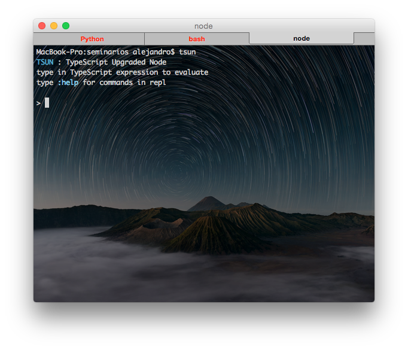

# Introducción a TypeScript

<i class="fa fa-smile-o"></i> Alejandro Such Berenguer

<i class="fa fa-envelope-o"></i> alejandro.such@gmail.com

<i class="fa fa-twitter"></i> @alejandro_such


## Requisitos

Instalación de TypeScript

<code>
$ npm install -g tsc
</code>


## Requisitos

Instalación de [tsd](https://github.com/DefinitelyTyped/tsd)

<code>
$ npm install -g tsd
</code>


## Requisitos

Instalación de [tsun](https://github.com/HerringtonDarkholme/typescript-repl) (TypeScript-Upgraded Node)

<code>
$ npm install -g tsun
</code>




## ¿Qué es TypeScript?

No es un lenguaje nuevo, sino un superset de ES6


---
Todo lo que hagamos en ES5 o ES6 será compatible con TypeScript


Muy pocos navegadores entienden ES6

Mucho menos TypeScript

Para ello, utilizamos transpilers


Un transpiler convierte código TypeScript a algo que entiende el navegador


Transpilers de ES6

 - [Babel](https://babeljs.io/)
 - [Traceur](https://github.com/google/traceur-compiler) (Google)


Transpiler de TypeScript

 - tsc


##Transpilando TypeScript

 Animal.ts

 ```
 export default class Animal {
   name: string;

   constructor(name) {
     this.name = name;
   }

   public greet():void {
     var msg:string = `Hello, I'm a ${this.name}`;
     console.log(msg);
   }
 }
 ```


##Transpilando TypeScript

 Dog.ts

 ```
 import Animal from './Animal';

 export default class Dog extends Animal {
   constructor() {
     super('Dog');
   }
 }
 ```


##Transpilando TypeScript

<code>
$ tsc Dog.ts --module commonjs
</code>


##Transpilando TypeScript

Animal.js

```
var Animal = (function () {
    function Animal(name) {
        this.name = name;
    }
    Animal.prototype.greet = function () {
        var msg = "Hello, I'm a " + this.name;
        console.log(msg);
    };
    return Animal;
})();
exports["default"] = Animal;

```


##Transpilando TypeScript

Dog.js

```
var __extends = (this && this.__extends) || function (d, b) {
    for (var p in b) if (b.hasOwnProperty(p)) d[p] = b[p];
    function __() { this.constructor = d; }
    d.prototype = b === null ? Object.create(b) : (__.prototype = b.prototype, new __());
};
var Animal_1 = require('./Animal');
var Dog = (function (_super) {
    __extends(Dog, _super);
    function Dog() {
        _super.call(this, 'Dog');
    }
    return Dog;
})(Animal_1["default"]);
exports["default"] = Dog;
```


##Transpilando TypeScript

```
//main.ts
import Animal from './Animal';
import Dog from './Dog';

var d:Animal = new Dog();

d.greet();
```


```
$ tsc main.ts --module commonjs
$ node main
Hello, I'm a Dog
```


##Transpilando TypeScript

Utilizándolo en node (ES5)


##Y cómo debugueo esto?

Muy bonito. Pero si escribo una cosa y ejecuto otra...

El código es un poco chungo, no?


Sourcemaps!


